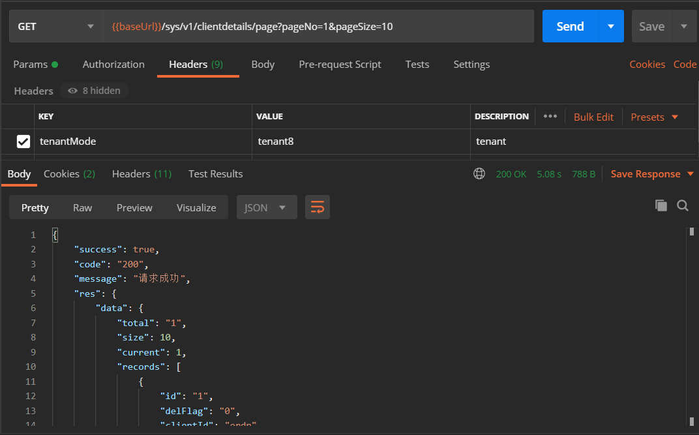
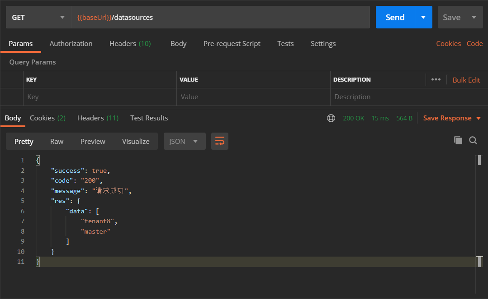
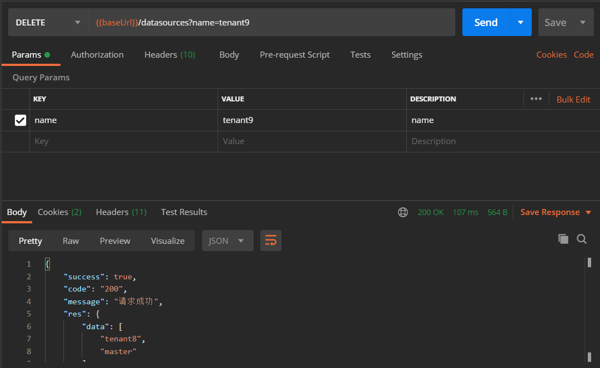

# springcloud-saas-starter

  此处只是方案说明，代码不便公开。

- 支持基于springboot的多租户数据源方案
- 支持 **Jdk 1.8+, SpringBoot 2.x.x**

## 使用方法

1. pom.xml中增加

```xml
        <dependency>
            <groupId>eric.cloud</groupId>
            <artifactId>springcloud-saas-starter</artifactId>
            <version>0.0.1-SNAPSHOT</version>
        </dependency>
```

2. 增加 **@TENANT** 支持多租户

|       注解        |         结果         |
| :---------------: | :-----------------: |
|    没有@TENANT    |     默认数据源       |
|    @TENANT       |    使用租户数据源     |

```java
@Service
public class UserServiceImpl implements UserService {
  @Override
  @TENANT 
  public List selectByCondition() {
      return null;
  }
}
```

3. 调用方法

  默认根据tenantMode决定租户数据源，
  每个微服务可以使用下文中的[可选方法](#jump)自定义

  

## 管理数据源

### 查看租户数据源

```
GET /datasources
```

#### Responses

|HTTP Code|Description|Schema|
|---|---|---|
|**200**|OK|[CommonResponse](#commonresponse)|

<a name="commonresponse"></a>
### CommonResponse

|Name|Description|Schema|
|---|---|---|
|**code**  <br>*required*|返回码|string|
|**message**  <br>*required*|返回消息|string|
|**res**  <br>*optional*||object|
|**success**  <br>*optional*||boolean|



### 增加租户数据源

```
POST /datasources/add
```

#### Parameters

|Type|Name|Description|Schema|
|---|---|---|---|
|**Body**|**dto**  <br>*required*|dto|[DataSourceDTO](#datasourcedto)|

<a name="datasourcedto"></a>
### DataSourceDTO

|Name|Description|Schema|
|---|---|---|
|**driverClassName**  <br>*optional*|JDBC驱动  <br>**Example** : `""`|string|
|**poolName**  <br>*optional*|数据源的名称  <br>**Example** : `"tenant1"`|string|
|**url**  <br>*optional*|JDBC地址  <br>**Example** : `""`|string|
|**username**  <br>*optional*|JDBC用户名|string|
|**password**  <br>*optional*|JDBC密码|string|

#### Responses

|HTTP Code|Description|Schema|
|---|---|---|
|**200**|OK|[CommonResponse](#commonresponse)|

### 删除租户数据源

```
DELETE /datasources
```

#### Parameters

|Type|Name|Description|Schema|
|---|---|---|---|
|**Query**|**name**  <br>*optional*|name|string|

#### Responses

|HTTP Code|Description|Schema|
|---|---|---|
|**200**|OK|[CommonResponse](#commonresponse)|



## 可选方法<span id="jump"/>

  支持每个微服务自定义租户数据源的获取方式

```java
import org.springframework.context.annotation.Configuration;

@Configuration
public class configuration {
    @Bean
    public DsProcessor dsProcessor(){
        return new TenantProcessor(){
            @Override
            public String doDetermineDatasource(MethodInvocation invocation,String key){
                // ...
                return "自定义数据源的名字";
            }
        };
    }   
}
```
